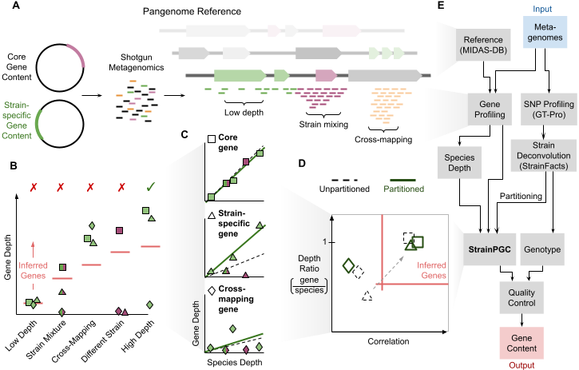

# Strain Partition Gene Content (StrainPGC)

Strain-informed gene content inference from shotgun metagenomes

## Summary

Pangenome profiling methods harness shotgun metagenomics to identify gene
families encoded in the genomes of individual strains.
By using a reference database of genes or genomes from a given
species, genes with sufficiently high mapping depth in a single sample are
inferred to be encoded by that species in that sample.

This approach has proven fruitful, but has three major shortcomings when
strain-specific gene content is desired:

1. In samples with multiple, strains, genes may not be assigned
   when they are missing from one or more of these genomes.
   due to lower depth relative to core genes.
2. Gene assignment error is elevated in low-abundance species due to a lower
   signal-to-noise ratio in mapping depth.
3. Assignments to individual species are ambiguous when gene families are found
   in the pangenomes of more than one species.

StrainPGC tackles these challenges by combining depth information across
multiple samples. Specifically, StrainPGC:

1. Combines depth across multiple samples to achieve a higher signal-to-noise
   ratio
2. Also considers the correlation between gene depth and species depth,
   reducing the impact of cross-mapping of reads across multiple species
3. Considers, one at a time, subsets of samples (partitions) where a single
   strain is believed to be present in order to overcome the obscuring effects
   of strain mixing

## Inputs:

The core StrainPGC method takes three inputs for each species:

1. Pangenome profiles: a sample-by-gene matrix of mapping depths
2. Species core genes: a list of genes believed to be found in single copy in every strain of the species
3. Strain partitions: a mapping of samples to individual strains

A suggested protocol for obtaining each of these inputs directly from raw
metagenomic data as part of the larger StrainPGC workflow is described below
and implemented as a Snakemake pipeline.

## Outputs

The key result provided by StrainPGC is a strain-by-gene matrix assigning gene
families to the genomes of each of the strains.

## The StrainPGC Workflow

A complete workflow can be divided into four phases:

1. Metagenomic profiling, which includes both:
    a. SNP profiling for strain tracking
    b. Pangenome profiling
2. Strain tracking / sample partitioning
3. Running the StrainPGC algorithm
4. Quality assessment / control

### SNP Profiling

The StrainPGC workflow uses [GT-Pro](https://github.com/zjshi/gt-pro) for SNP profiling,
which captures metagenotypes across polymorphic positions found in the
[Unified Human Gut Genome](https://doi.org/10.1038/s41587-020-0603-3) reference database.

### Pangenome Profiling

The StrainPGC workflow implements pangenome profiling against the
(MIDAS2 UHGG reference database)[https://github.com/czbiohub-sf/MIDAS2] gene
clusters using using Bowtie2-based read mapping.

While other profiling tools may be used, excessive post-hoc filtering
of mapping depth can be detrimental and we find competitive mapping
to a reference index that includes multiple species reduces the issue of
cross mapping of reads from other species.

**This step is by far the most computationally intensive, dwarfing by far the
runtime and memory requirements of all other steps.**

### Strain tracking

The StrainPGC workflow tracks strains based on SNP profiles using [StrainFacts](https://github.com/bsmith89/StrainFacts).

Strain partitions are then composed of samples pure (or nearly pure) for a
single strain.

### Quality assessment

The quality of gene content assignments for each strain can be assessed
post-hoc based on

1. The fraction of species core genes assigned
2. Detecting outliers with an anomalous total numbers of genes assigned

Strains failing these two checks should be removed from downstream analyses.

### Additional utilities

Tools are included with StrainPGC for several auxiliary purposes:

- Identifying species core genes based on a reference genome-by-gene occurrence
  table.
- TODO: What else is needed?

## Citation

For now, please cite this repository directly.
A Zenodo DOI will be available in the near future as well as a BioRxiv
preprint.

