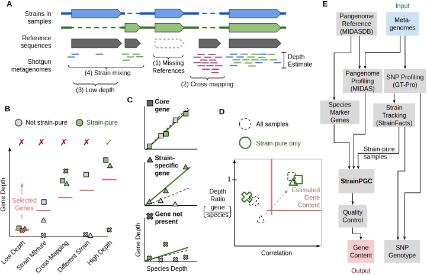

# `Strain` `P`ure `G`ene `C`ontent (StrainPGC)

Strain-informed gene content inference from shotgun metagenomes

## Citation

The StrainPGC manuscript is currently under revisions.
For now, please cite the [BioRxiv preprint](https://doi.org/10.1101/2024.04.10.588779).

## Quick-start

### Installation

StrainPGC is a Python package. A Python version >=3.11 is recommended
(although other versions may also work)
StrainPGC can be installed directly from GitHub using pip:

```
git clone https://github.com/bsmith89/StrainPGC StrainPGC
cd StrainPGC
pip install -e .  # Editable installation for development.
```

This will also install all Python software dependencies, which currently entail:

- pandas
- xarray
- netcdf4
- scipy

It is also recommended to install StrainPGC in an isolated Python environment (e.g. a `conda env`).

### Running StrainPGC on Example Inputs

The following example demonstrates running StrainPGC on
a small input dataset.

#### Step 1: Navigate to the example directory

From the root of the StrainPGC repository,

```
cd examples/core_example
```

Example input data for the core `spgc` tool are provided for testing and
to demonstrate the correct file formats.

This includes three files:

- `pangenome_profile.depth.tsv.bz2` (matrix of sample-by-gene depths.)
- `species_genes.list` (list of species-quantitative genes expected to be at 1x depth)
- `strain_pure_samples.tsv` (mapping from strain-pure-samples to their strain identity)


#### Step 2: Run StrainPGC

With correctly formatted input files, like those provided, the StrainPGC method can be run as follows:

```
spgc run \
    pangenome_profile.depth.tsv.bz2 \
    species_genes.list \
    strain_pure_samples.tsv \
    spgc.results.nc
```

The output file, `spgc.results.nc`, is an binary format which includes
a variety of statistics about genes and strains.

This file can be parsed directly using the XArray library in Python.


#### Step 3: Dump results to text files

```
spgc dump_genes spgc.results.nc spgc.gene.tsv
spgc dump_strains spgc.results.nc spgc.strain.tsv
```

The two output files are:

- `spgc.gene.tsv` (estimated gene content)
- `spgc.strain.tsv` (strain statistics)

Additional subcommands and options are described in the help:

```
spgc --help
spgc run --help
```

### Running an Integrated StrainPGC-wf

A complete StrainPGC workflow going from raw input reads to estimated gene
content has been implemented using Snakemake (see `workflow/Snakefile`) and
incorporates metagenome preprocessing, MIDAS, GT-Pro, and StrainFacts.

The following example demonstrates running this workflow on a small number
of example shotgun metagenomes.


**NOTE: Running this example workflow requires a substantial amount of disk storage, memory, and CPU time. ([see below](#system-requirements).)**

#### Step 0: Install required software

You'll need to [install Snakemake](https://snakemake.readthedocs.io/en/stable/getting_started/installation.html#installation) (version >= 8.20).

By default, this workflow implementation leverages Snakemake's Apptainer (formerly Singularity)
integration to download and run a pre-built container
(https://hub.docker.com/r/bsmith89/strainpgc-wf)
integrating StrainPGC and all other dependencies of the workflow.

If Apptainer is not available on your system,
the same [container](https://hub.docker.com/r/bsmith89/strainpgc-wf) can be used with Docker
and includes a Snakemake installation.
Alternatively you can install the necessary software directly to your system.

#### Step 1: Navigate to the example directory

From the root of the StrainPGC repository,

```
cd examples/wf_example
```

#### Step 2: Download references and example data

Example input files for the workflow are provided for testing.

These raw metagenomes and the necessary GT-Pro reference data can be downloaded
using included scripts as follows:

```
bash scripts/download_gtpro_refs.sh ref/gtpro
bash scripts/download_example_reads.sh raw
```

#### Step 3: Dry-Run / Pre-Check

```
species=102506  # MIDAS/UHGG/GT-Pro species ID for E. coli
num_procs=12  # Number of CPU processes

snakemake --profile profiles/apptainer \
        --dry-run \
        --configfile config.yaml \
        "results/species/$species/spgc.strain.tsv" \
        "results/species/$species/spgc.gene.tsv"
```

#### Step 4: Actually Run the Snakemake Workflow

```
species=102506  # MIDAS/UHGG/GT-Pro species ID for E. coli
num_procs=12  # Number of CPU processes

snakemake --profile profiles/apptainer \
        -j "$num_procs" \
        --configfile config.yaml \
        "results/species/$species/spgc.strain.tsv" \
        "results/species/$species/spgc.gene.tsv"
```

For different compute environments, a different
[Snakemake profiles](https://snakemake.readthedocs.io/en/stable/executing/cli.html#profiles) may be advisable.
For instance, the alternative profile in `examples/wf_example/profiles/noenv` assumes
that all necessary software has been installed directly to your system.


## Understanding StrainPGC

The motivation and methodological details are fully described, benchmarked, and
demonstrated in [our manuscript](https://doi.org/10.1101/2024.04.10.588779).

### Summary

Pangenome profiling methods harness shotgun metagenomics to identify gene
families encoded in the genomes of individual strains.
By using a reference database of genes or genomes from a given
species, genes with sufficiently high mapping depth in a single sample are
inferred to be encoded by that species in that sample.

This approach has proven fruitful, but has three major shortcomings when
strain-specific gene content is desired:

1. In samples with multiple strains, genes may not be assigned
   when they are missing from one or more of these genomes.
   due to lower depth relative to core genes.
2. Gene assignment error is elevated in low-abundance species due to a lower
   signal-to-noise ratio in mapping depth.
3. Assignments to individual species are ambiguous when gene families are found
   in the pangenomes of more than one species.

StrainPGC tackles these challenges by combining depth information across
multiple samples. Specifically, StrainPGC:

1. Combines depth across multiple samples to achieve a higher signal-to-noise
   ratio
2. Also considers the correlation between gene depth and species depth,
   reducing the impact of cross-mapping of reads across multiple species
3. Considers, one at a time, subsets of samples where a single
   strain is believed to be present in order to overcome the obscuring effects
   of strain mixing



### Inputs

The core StrainPGC method takes three inputs for each species:

1. Pangenome profiles: a sample-by-gene matrix of mapping depths
2. Species core genes: a list of genes believed to be found in single copy in every strain of the species
3. Strain-pure samples: a mapping of samples to individual strains

A suggested protocol for obtaining each of these inputs directly from raw
metagenomic data as part of the larger StrainPGC workflow is described below
and implemented as a Snakemake pipeline.

### Outputs

The key result provided by StrainPGC is a strain-by-gene matrix indicating
which genes are estimated to be present and which absent in the genomes of each of the
strains.

### The StrainPGC Workflow

A complete workflow can be divided into four phases:

1. Metagenomic profiling, which includes both:
    - SNP profiling for strain tracking
    - Pangenome profiling
2. Strain tracking / identification of strain-pure sets
3. Running the StrainPGC algorithm
4. Quality assessment / control

We have implemented a version of this workflow as a Snakemake pipeline.
Applied to the [example data](https://github.com/bsmith89/StrainPGC#running-an-integrated-strainpgc-wf),
this pipeline can be visualized as the following
graph of dependencies:

[](https://raw.githubusercontent.com/bsmith89/StrainPGC/refs/heads/main/docs/workflow_graph.svg)

#### SNP profiling

The StrainPGC workflow uses [GT-Pro](https://github.com/zjshi/gt-pro) for SNP profiling,
which captures metagenotypes across polymorphic positions found in the
[Unified Human Gut Genome](https://doi.org/10.1038/s41587-020-0603-3) reference database.

#### Pangenome profiling

The StrainPGC workflow implements pangenome profiling against the
(MIDAS UHGG reference database)[https://github.com/czbiohub-sf/MIDAS] gene
clusters using using Bowtie2-based read mapping.

While other profiling tools may be used, excessive post-hoc filtering
of mapping depth can be detrimental and we find competitive mapping
to a reference index that includes multiple species reduces the issue of
cross mapping of reads from other species.

**This step is by far the most computationally intensive, dwarfing by far the runtime and memory requirements of all other steps.**

#### Strain tracking

The StrainPGC workflow estimates strain compositions in each sample based on
SNP profiles using [StrainFacts](https://github.com/bsmith89/StrainFacts).

Sets of samples that are pure (or nearly pure) for a single strain are selected based on these estimates.

#### Quality assessment

The quality of gene content assignments for each strain can be assessed
post-hoc based on

1. The fraction of species core genes assigned
2. The noisyness of the normalized depths of strain genes

Each of these scores is calculated by StrainPGC and can be read off the table
of strain statistics obtained with `spgc dump_strains`.

Strains with too few core genes (e.g. a `species_gene_frac` < 95%) or too much
noise in gene depths (e.g. a `log_selected_gene_depth_ratio_std` > 0.25) should
be removed from downstream analyses.

In addition, for the StrainPGC manuscript, we removed strains with fewer than
100 positions confidently genotyped by GT-Pro after StrainFacts partitioning
and sample pooling.

## System requirements

Running this workflow requires a substantial amount of storage,
memory, and CPU time.

Based on benchmarking using the example data on our servers, this included:

- Disk (~200 GB with all intermediate data)
    - Reference files (downloaded in Step 2, below) totaled more than 50 GB.
    - The portion of the UHGG MIDASDB used here (71 species profiled downloaded as one step in the integrated workflow for the ) was more than 20 GB.
    - The raw shotgun metagenomes downloaded from the HMP2 FTP server totaled more than 6 GB.
    - Intermediate files generated by the workflow totaled more than 70 GB.
    - Downloaded apptainer containers totaled more than 5 GB
- RAM (~90 GB at peak)
    - GT-Pro required ~55 GB at peak, although almost all of this can be shared between samples thanks to memory mapping.
    - Building the MIDAS Bowtie2 index with 48 threads required ~90 GB at peak.
    - Running MIDAS pangenome profiling required ~32 GB at peak.
    - Memory requirements for other steps were generally negligible by comparison.
- CPU Time
    - In particular, building the Bowtie2 index takes a long time:
      about ~60 hours of CPU time shared over 48 processes for a total walltime of ~130 minutes.
    - Running MIDAS pangenome profiling took ~3.5 hours of CPU time for the largest samples.
      This was efficiently split across four processes for a total of ~10 minutes of walltime.
    - CPU requirements for other steps were generally negligible by comparison.


## StrainPGC Development

### Development Install

Using an editable installation with `pip install -e` is the best (and easiest)
way to get started on the StrainPGC codebase.

It should be possible to _also_ use the pre-built Docker container by binding the
root of the StrainPGC repository to `/src/StrainPGC` in that container.

For instance, the example in the StrainPGC-wf quick-start
can be run as follows:

```
species=102506  # MIDAS/UHGG/GT-Pro species ID for E. coli
num_procs=12  # Number of CPU processes

snakemake --profile profile \
        --apptainer-args "--bind /path/to/StrainPGC:/src/StrainPGC"
        -j "$num_procs" \
        "results/species/$species/spgc.strain.tsv" \
        "results/species/$species/spgc.gene.tsv"
```

Replacing `/path/to/StrainPGC` with the path to your StrainPGC
code repository.

In this way, edits to the Python package will be reflected
in the Snakemake execution.

### Building the Docker Image

```
docker build -t bsmith89/strainpgc-wf -t bsmith89/strainpgc-wf:latest -f workflow/envs/Dockerfile .
docker run -it --rm -v $(pwd)/../..:$(pwd)/../.. bsmith89/strainpgc-wf:latest
docker push bsmith89/strainpgc-wf
```
